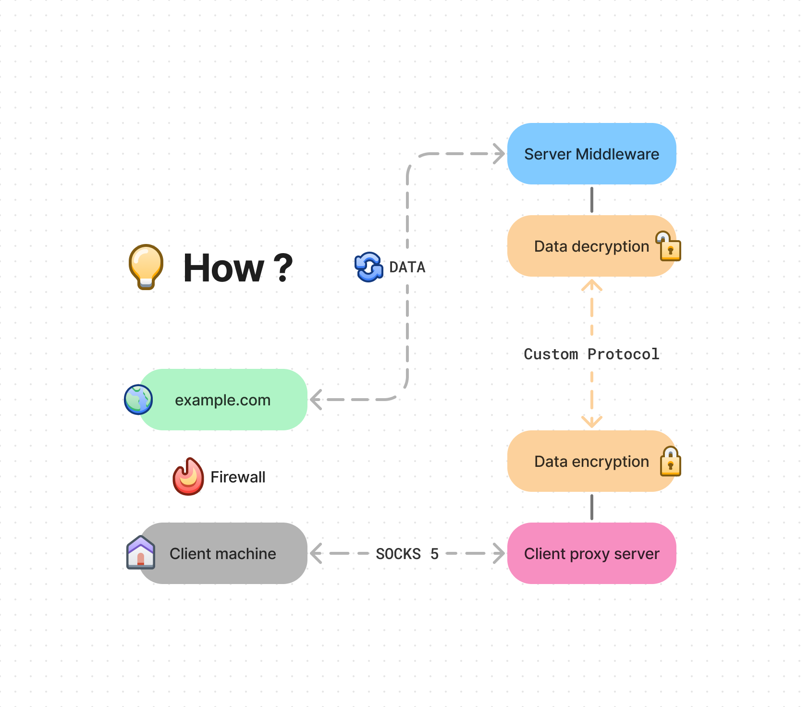

# TypeScript Socks5 Proxy tunnel

make your own protocol behind Socks5 proxy



## Installation 
you need to run script inside **Server** and also **Client** to communicate with each other.
install [***bun***](https://bun.sh) inside **Server** and **Client** and restart your terminal.

```sh
curl -fsSL https://bun.sh/install | bash
```

## Server

you need to have a public port for run the server
- port : the server port ```0 - 0xFFFF```

```sh
bun index.ts (port)
```

## client 

and run script inside client

- server : ip address or domain of server
- port : the server port ```0 - 0xFFFF```

```sh
bun index.ts (server) (port)
```